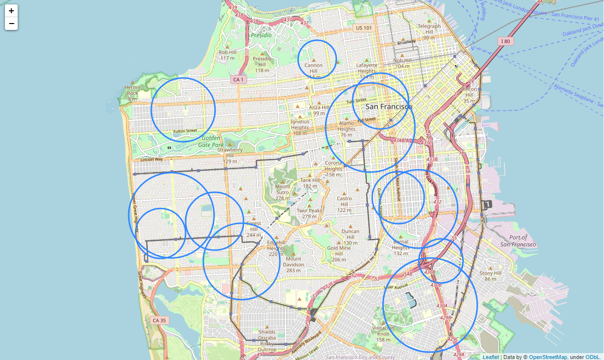
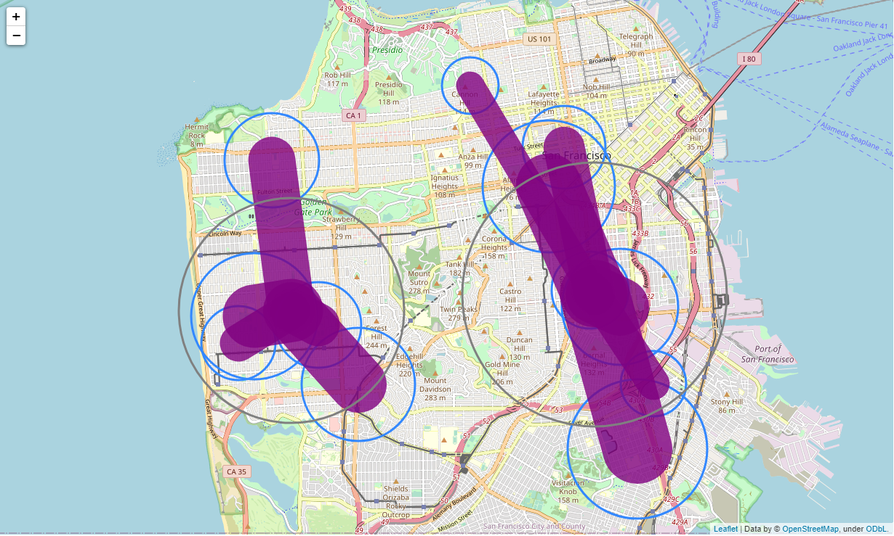

# Instacart Warehouses
This is a program to analyze the optimal locations for Instacart. The company has the partnership with over 20 high schools in San Fransisco. Use K-means methodology to get the centers of gravity. The results are two optimal warehouse locations.

# Constraint
The center of gravity is therefore the location giving the lowest total transport costs.

## Table of Content
* [Features](https://github.com/byu5/InstacartWarehouse/blob/main/README.md#features)
* [Get Started](https://github.com/byu5/InstacartWarehouse/blob/main/README.md#get-started)
* [Contributors](https://github.com/byu5/InstacartWarehouse/blob/main/README.md#contributors)

## Features
The data analysis will provide:
- Map of the optimal warehouse locations

## Data Visualizations

## Get Started
+ You will need to install the folium module using !pip install folium.

+ The columns include location name, latitude, longitude, and volume.

## Contributors

- Giani Kurniawan
- Barry Yu
- Weijia Wang

## Credits
[Logistics Center of Gravity Analysis in Python](https://medium.com/analytics-vidhya/logistics-center-of-gravity-analysis-in-python-a21ad034f849) by Victor Angelo Blancada
